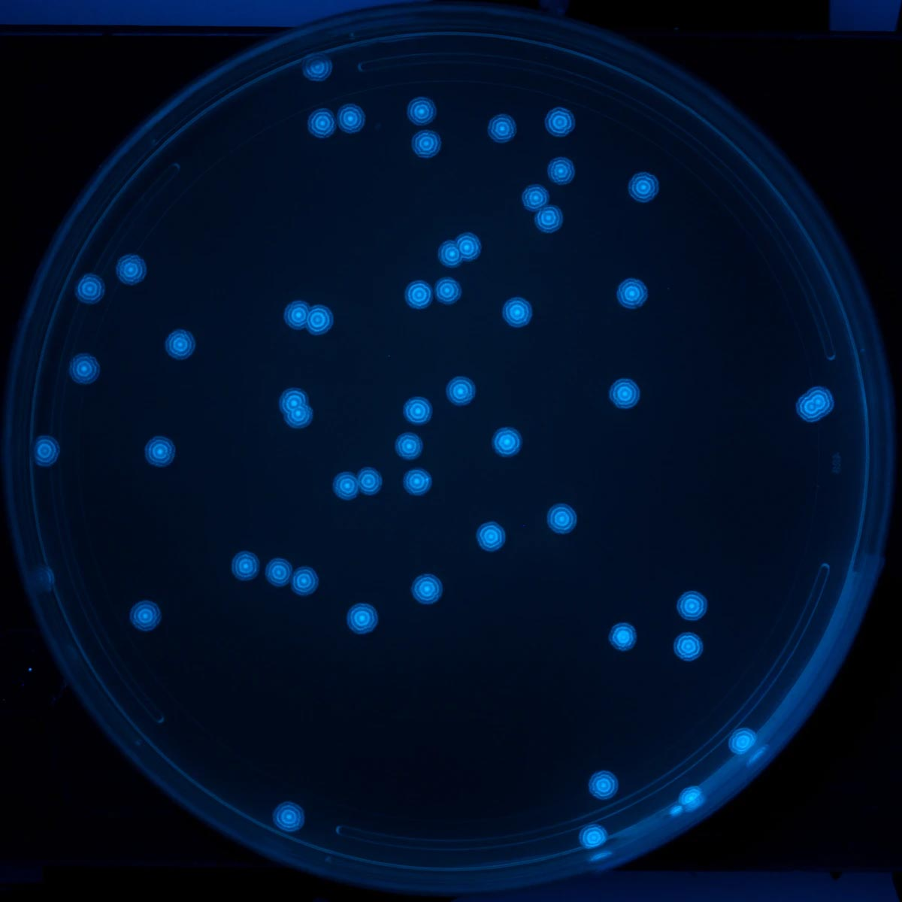
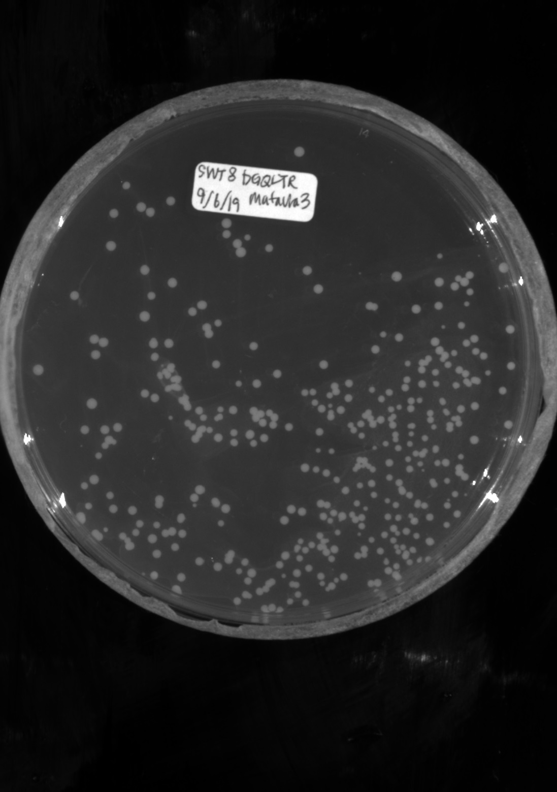
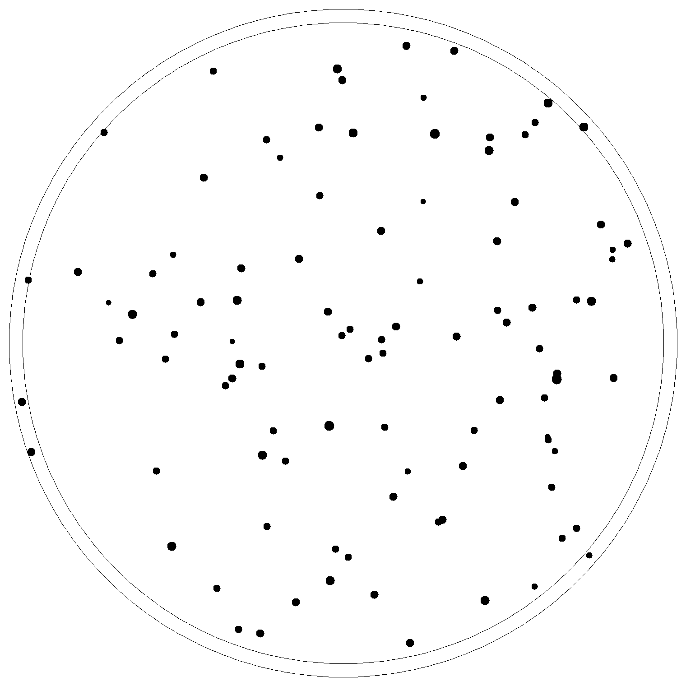
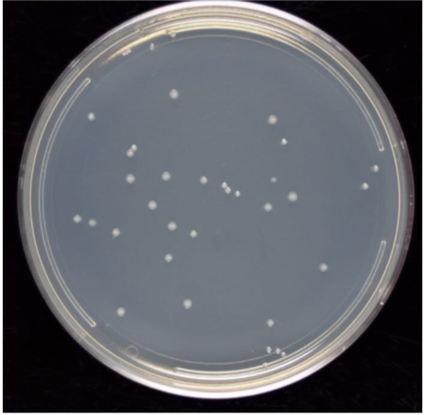
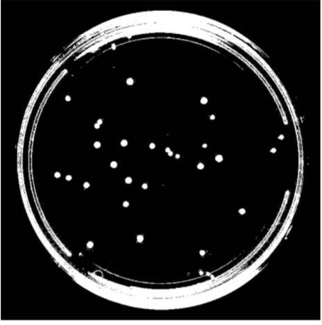
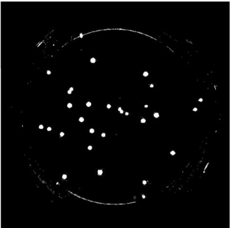
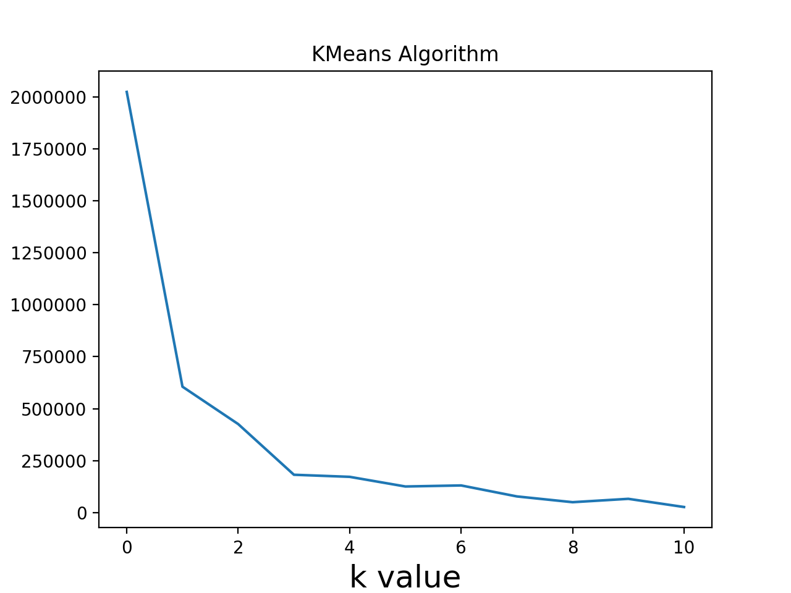
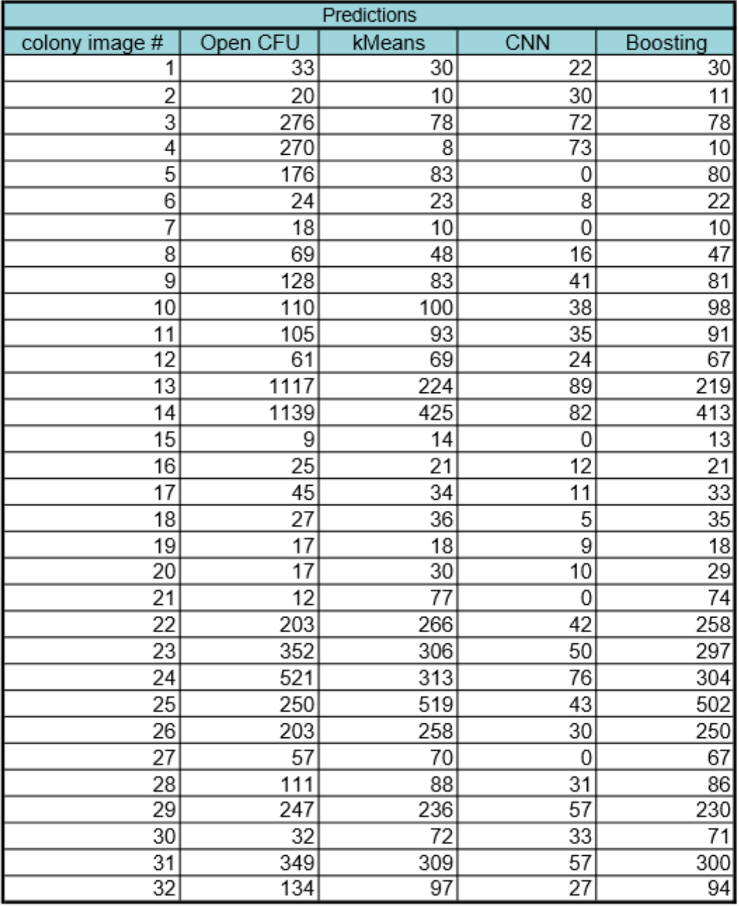
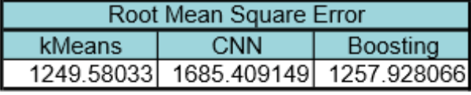

## Introduction

The traditional and preferred method for quantifying microbe populations is by colony enumeration. This process involves serially diluting liquefied samples, plating the samples on media plates, and counting the resulting colony-forming units. Assuming each colony-forming unit originates from a single microbe, the number of microbes can then be back-calculated 

Research technicians typically count the number of colonies by hand, which can number up towards hundreds on a plate. The task of counting is tedious and prone to error. To reduce this burden, we aim to develop a program to digitally enumerate the number of colony-forming units using images of the sampled media plates.

## Dataset

The dataset consists of two groups, training data, and testing data. The training dataset was generated via a colony-plate image generator. Colony variables that were tuned include the radius, x position, and y position. Radiuses were generated along a standard normal distribution to best emulate real data. The data set used to test the program consists of 32 real plate images taken at a group member’s lab. 

| Real plate image | Generated image |
| --- | --- |
|  |  |

## Preprocessing

The testing data is pre-processed in 3 steps to simplify features. 

(1).  Convert each image to binary to create a clear distinction between the plate and colony pixels. We used Otsu’s method to determine the optimal threshold value for each image.

(2).  Remove the petri dish perimeter so that only the microbe colonies appear in the foreground (white). Connected units of white pixels that exceeded a certain size in proportion to the image size were classified as the petri-dish pixels and removed from the final output via masking

(3).  Resize all images to a standard 400 x 400 pixels in order to run the algorithm under a reasonable time constraint. The computer generated images in the training set do not need to be pre-processed since they were created in the proper format to begin with. 

| Real plate image | Binary image | Binary image without petri|
| --- | --- | --- |
|  |  | |

## Methods

We first use Open CFU to get the number of colonies in each petri dish as the actual colony number. Here is the link http://opencfu.sourceforge.net/. 
Then, from our preprocessed data, we will attempt two methods to quantify the number of colonies:

### KMeans

Using our preprocessed data, we get the array of pixel values of preprosseeded image. Since the image only contains white and black colors, the pixel value only contains 0 and 255. Based on  the image’s background, we cluster the image with the x and y values of each pixel with value 255(if colonies are white) or value 0(if colonies are black). According to the Open CFU, the maximal colony number is 1200, therefore, we set the maximal k to be 1500 and use a for loop to find the optimal k value with elbow criteria. The k value is the number of colonies on the petri dish. 

The plot image shown below is the k value plot of a colony image with 33 colonies. From the plot we can see that the optila k value is around 3 and 4, which means the estimated colony number is around 30 to 40.

### CNN

### Boosting

## Results

Our results are summarized below. In the first table are our predictions for our two models-kMeans and CNN-and the combined results after using gradient boosting regression. From boosting, we found that the kmeans model had much more weight (0.96) in comparison to CNN (0.04). The difference in weight is due to the predictive accuracy of each model. Kmeans performed better than CNN in predicting the colony images. The CNN model seems to perform better at lower colony counts, but fails at higher numbers on real colony images. We expected this failure from CNN because we did not have enough real colony images to train CNN and instead it was trained on generated images. The second table below summarizes the performance of each of the models by comparing their root mean square error to the “true” count predictions (Open CFU counts). 

  

